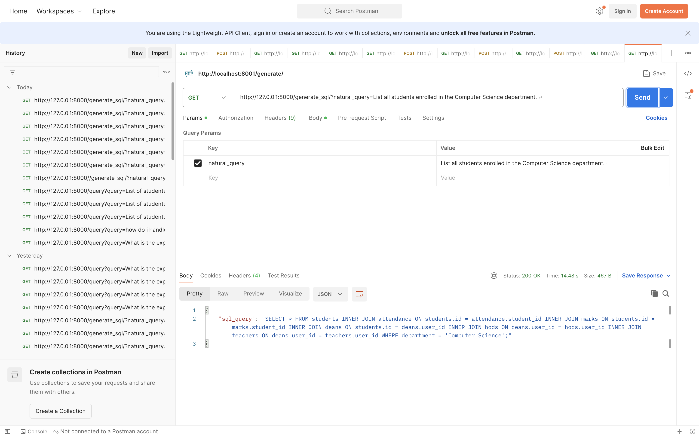

# **Natural Language to SQL Query Generator**

## **INTRODUCTION**
This project leverages a local Llama 3.2 model to convert natural language queries into SQL statements. It enables seamless interaction with structured databases without requiring direct SQL knowledge. By integrating FastAPI, this system provides a RESTful API to process natural language queries and return corresponding SQL queries.

## **FEATURES**
- **AI-powered SQL Generation**: Converts natural language queries into accurate SQL statements.
- **FastAPI Integration**: Provides a RESTful API for generating SQL queries dynamically.
- **Database Schema Awareness**: Utilizes a predefined database schema for context-aware SQL generation.
- **Automated Query Execution**: Executes the generated SQL queries on a SQLite database.
- **Optimized Query Formatting**: Uses `sqlparse` to format queries for better readability.

## **METHODOLOGY**
1. **Database Schema Definition**: A structured schema is predefined, including relationships and data types.
2. **Natural Language Processing**: The user submits a query in natural language.
3. **Llama Model Processing**: The prompt, including schema and query, is sent to the local Llama 3.2 model.
4. **SQL Query Extraction**: Extracts valid SQL queries from the Llama model’s response using regex.
5. **Query Formatting**: SQL statements are properly formatted using `sqlparse`.
6. **Query Execution**: The generated SQL query is executed on an SQLite database (optional step for verification).
7. **Result Delivery**: The output is returned as structured data for further usage.

## **USAGE**
1. Start the FastAPI server:
   ```sh
   uvicorn main:app --reload
   ```
2. Send a natural language query to the API:
   ```sh
   http://127.0.0.1:8000/generate_sql/?natural_query=List all students enrolled in the Computer Science department.
   ```
3. The API returns the SQL query based on the provided database schema.
4. (Optional) Execute the query on an SQLite database to retrieve results.

## **APPLICATION**
- **Automating Data Retrieval**: Simplifies data extraction from databases.
- **SQL Query Assistance**: Helps users unfamiliar with SQL generate complex queries.
- **Business Intelligence & Analytics**: Assists non-technical users in analyzing data.

## **OUTPUT ON POSTMAN**


This project is a step towards making database interactions more accessible and intuitive for everyone. 🚀

